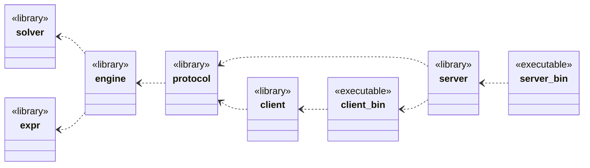
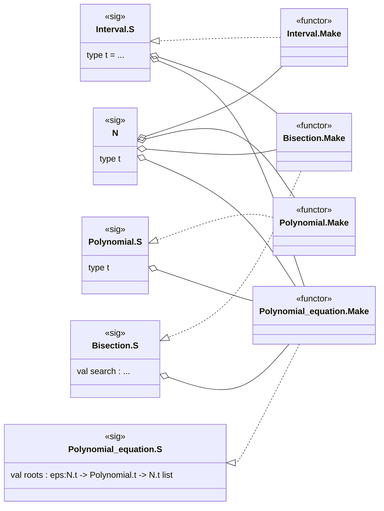
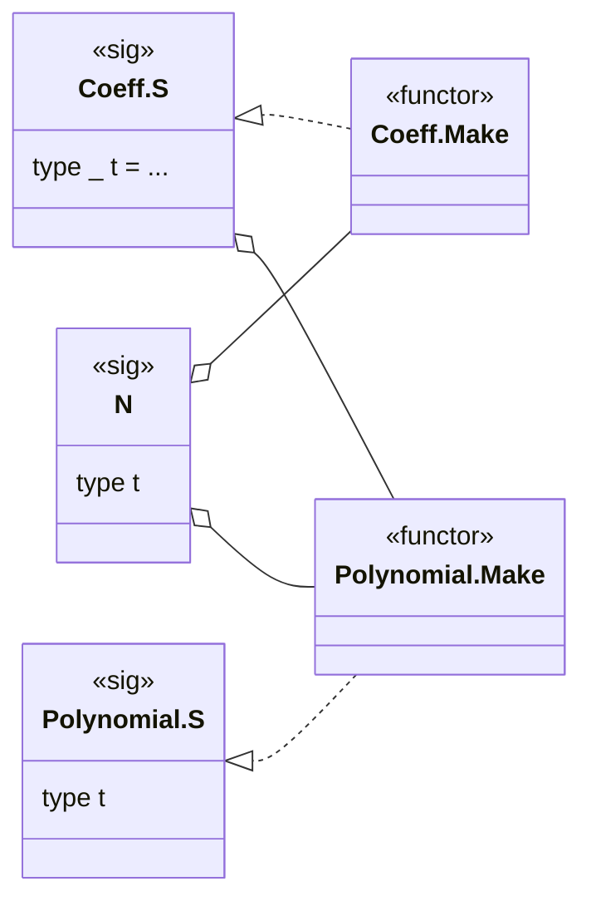

```mermaid
classDiagram
  direction RL
  class solver {
    <<library>>
  }
  class expr {
    <<library>>
  }
  class engine {
    <<library>>
  }
  class protocol {
    <<library>>
  }
  class client {
    <<library>>
  }
  class server {
    <<library>>
  }
  class client_bin {
    <<executable>>
  }
  class server_bin {
    <<executable>>
  }
  engine ..> solver
  engine ..> expr
  protocol ..> engine
  server ..> protocol
  client ..> protocol
  client_bin ..> client
  server_bin ..> server
  server ..> client_bin
```

```mermaid
classDiagram
  direction RL
  class N {
    <<sig>>
    type t
  }
  class `Interval.S` {
      <<sig>>
      type t = ...
  }
  class `Interval.Make` {
      <<functor>>
  }
  class `Polynomial.S` {
      <<sig>>
      type t
  }
  class `Polynomial.Make` {
      <<functor>>
  }
  class `Bisection.S` {
      <<sig>>
      val search : ...
  }
  class `Bisection.Make` {
      <<functor>>
  }
  class `Polynomial_equation.S` {
      <<sig>>
      val roots : eps:N.t -> Polynomial.t -> N.t list
  }
  class `Polynomial_equation.Make` {
      <<functor>>
  }
  `Interval.Make` ..|> `Interval.S`
  `Interval.Make` --o N
  `Polynomial.Make` ..|> `Polynomial.S`
  `Polynomial.Make` --o N
  `Bisection.Make` ..|> `Bisection.S`
  `Bisection.Make` --o N
  `Bisection.Make` --o `Interval.S`
  `Polynomial_equation.Make` ..|> `Polynomial_equation.S`
  `Polynomial_equation.Make` --o N
  `Polynomial_equation.Make` --o `Interval.S`
  `Polynomial_equation.Make` --o `Polynomial.S`
  `Polynomial_equation.Make` --o `Bisection.S`
```

```mermaid
classDiagram
  direction RL
  class N {
    <<sig>>
    type t
  }        
  class `Coeff.S` {
      <<sig>>
      type _ t = ...
  }
  class `Coeff.Make` {
      <<functor>>
  }
  class `Polynomial.S` {
      <<sig>>
      type t
  }
  class `Polynomial.Make` {
      <<functor>>
  }
  `Coeff.Make` ..|> `Coeff.S`
  `Coeff.Make` --o N
  `Polynomial.Make` ..|> `Polynomial.S`
  `Polynomial.Make` --o N
  `Polynomial.Make` --o `Coeff.S`
```
