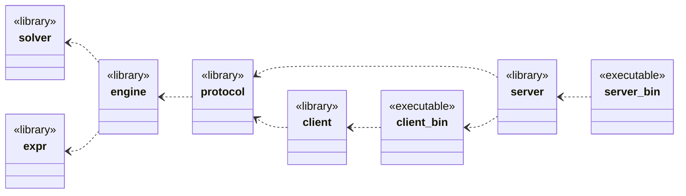

```mermaid
classDiagram
  direction RL
  class solver {
    <<library>>
  }
  class expr {
    <<library>>
  }
  class engine {
    <<library>>
  }
  class protocol {
    <<library>>
  }
  class client {
    <<library>>
  }
  class server {
    <<library>>
  }
  class client_bin {
    <<executable>>
  }
  class server_bin {
    <<executable>>
  }
  engine ..> solver
  engine ..> expr
  protocol ..> engine
  server ..> protocol
  client ..> protocol
  client_bin ..> client
  server_bin ..> server
  server ..> client_bin
```
